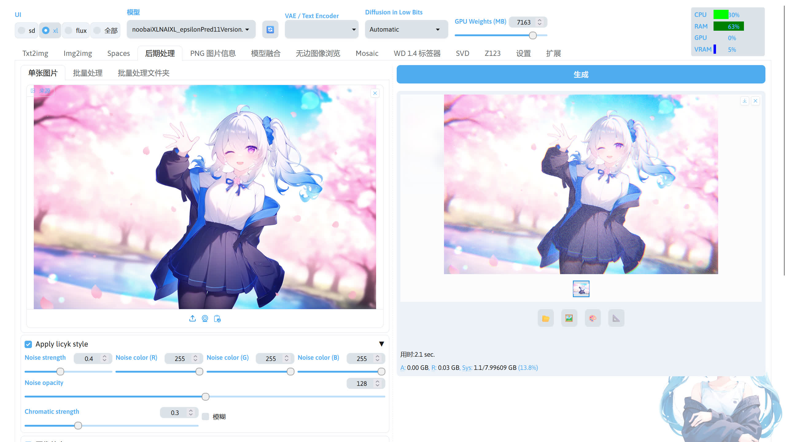
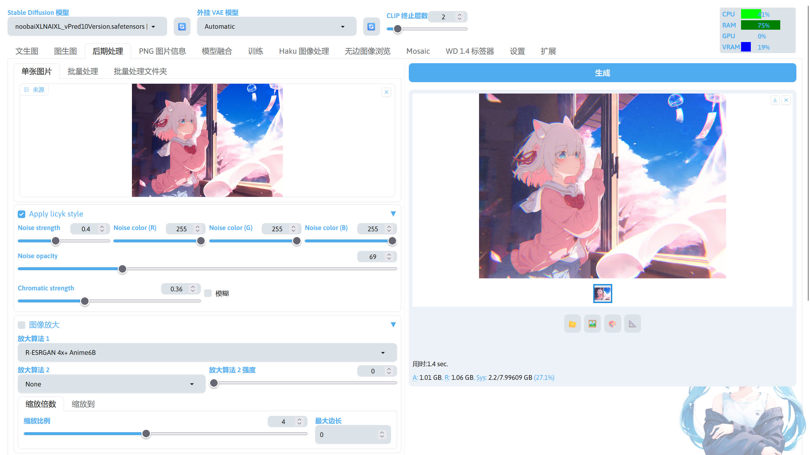

<div align="center">

# sd-webui-licyk-style-image


_*✨图像色差噪波风格*_

📓 · [Documents](./README.md) · [中文文档](./README-zh.md)

</div>

- [sd-webui-licyk-style-image](#sd-webui-licyk-style-image)
  - [简介](#简介)
  - [安装](#安装)
    - [通过命令安装](#通过命令安装)
    - [通过 Stable Diffusion WebUI 安装](#通过-stable-diffusion-webui-安装)
    - [通过绘世启动器安装](#通过绘世启动器安装)
  - [使用](#使用)
  - [鸣谢](#鸣谢)


## 简介
一个为图片添加滤镜效果的扩展，适用于 [Stable Diffusion WebUI](https://github.com/AUTOMATIC1111/stable-diffusion-webui) / [Stable Diffusion WebUI Forge](https://github.com/lllyasviel/stable-diffusion-webui-forge)。

给图片加上色差和噪声的效果后，看起来还挺不错的，有种独特的风格。

不过我不知道怎么为这个风格进行命名，所以就用自己的名字来命名这个风格了。


## 安装
### 通过命令安装

进入 Stable Diffusion WebUI / Stable Diffusion WebUI 的 extensions 目录：

```bash
cd extensions
```

使用 Git 命令下载该扩展：

```bash
git clone https://github.com/licyk/sd-webui-licyk-style-image
```


### 通过 Stable Diffusion WebUI 安装
进入 Stable Diffusion WebUI 界面后，点击`扩展`->`从网址安装`，将下方的链接填入`扩展的 git 仓库网址`输入框：

```
https://github.com/licyk/sd-webui-licyk-style-image
```

点击`安装`下载该扩展。


### 通过绘世启动器安装
打开绘世启动器，点击`版本管理`->`安装新扩展`，在下方的`扩展 URL`输入框填入下方的链接

```
https://github.com/licyk/sd-webui-licyk-style-image
```

点击输入框右侧的`安装`下载该扩展。


## 使用
扩展安装完成后，可以在 Stable Diffusion WebUI 的**后期处理** -> **Apply licyk style** 使用该扩展。

该扩展也可在**文生图** / **图生图** -> **Apply licyk style** 中使用，启用后将在 VAE 解码后为每张生成的图片添加滤镜，滤镜参数会保存到图片的生成信息中。





柔光滤镜（类似 VTuber 常用的柔光滤镜）可为图片添加环境光晕、柔焦和边缘柔化效果，`Glow strength` 为 0 时不启用。

- `Glow strength`：环境光晕强度
- `Glow threshold`：产生光晕的高光亮度阈值
- `Glow radius (%)`：光晕半径，为图片短边长度的百分比
- `Glow color (R/G/B)`：光晕颜色
- `Soft focus`：柔焦，柔化图片中的边缘和线条
- `Edge softness`：图片四周的边缘柔化雾化强度


## 鸣谢
[KohakuBlueleaf](https://github.com/KohakuBlueleaf)：提供 Chromatic 算法。
