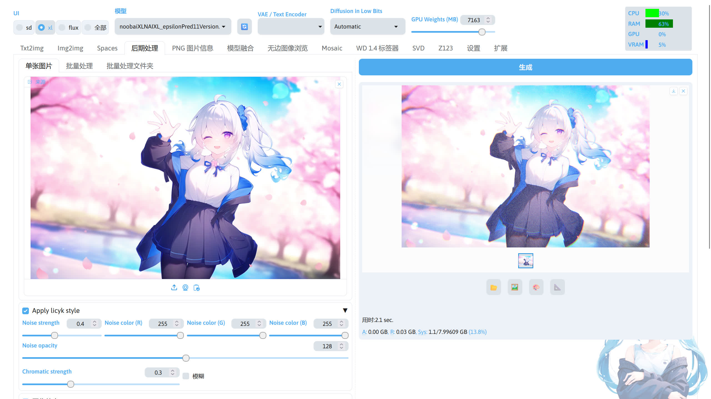
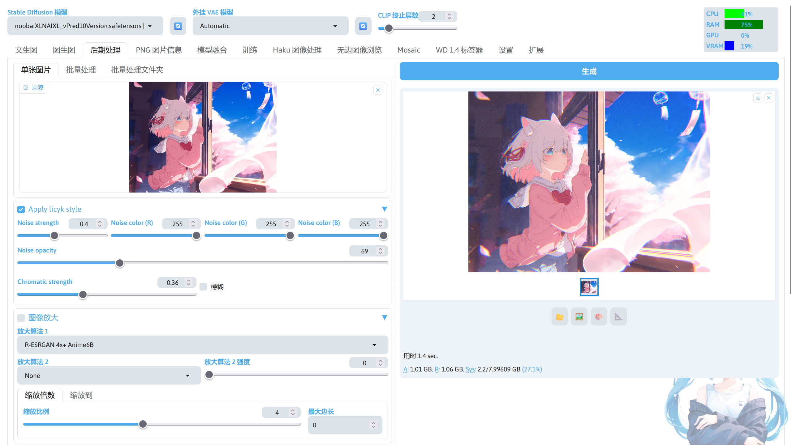

<div align="center">

# sd-webui-licyk-style-image


_*✨Chromatic stylization with noise augmentation for illustrations*_

📓 · [Documents](./README.md) · [中文文档](./README-zh.md)

</div>

- [sd-webui-licyk-style-image](#sd-webui-licyk-style-image)
  - [Introduction](#introduction)
  - [Installation](#installation)
    - [Command Line Installation](#command-line-installation)
    - [Stable Diffusion WebUI Installation](#stable-diffusion-webui-installation)
    - [Huishi Launcher Installation](#huishi-launcher-installation)
  - [Usage](#usage)
  - [Acknowledgements](#acknowledgements)


## Introduction
An extension for applying filter effects to images, compatible with [Stable Diffusion WebUI](https://github.com/AUTOMATIC1111/stable-diffusion-webui) / [Stable Diffusion WebUI Forge](https://github.com/lllyasviel/stable-diffusion-webui-forge).

After applying chromatic aberration and noise effects to images, they acquire a distinctive visual style. Since I couldn't find an appropriate name for this particular style, I've chosen to name it using my own identifier.


## Installation
### Command Line Installation
Navigate to the extensions directory of your Stable Diffusion WebUI installation:

```bash
cd extensions
```

Clone the repository using Git:

```bash
git clone https://github.com/licyk/sd-webui-licyk-style-image
```


### Stable Diffusion WebUI Installation
1. Open Stable Diffusion WebUI interface.
2. Go to `Extensions` -> `Install` from URL.
3. Paste the following URL in the repository field:

```
https://github.com/licyk/sd-webui-licyk-style-image
```

4. Click `Install`.


### Huishi Launcher Installation
1. Launch Huishi Launcher.
2. Navigate to `Version Management` -> `Install New Extension`.
3. Enter the following URL in the extension URL field:

```
https://github.com/licyk/sd-webui-licyk-style-image
```

4. Click the `Install` button adjacent to the input field


## Usage
After successful installation, access the extension through: `Postprocessing` -> `Apply licyk style` in Stable Diffusion WebUI.






## Acknowledgements
[KohakuBlueleaf](https://github.com/KohakuBlueleaf): Implementation of the Chromatic algorithm.